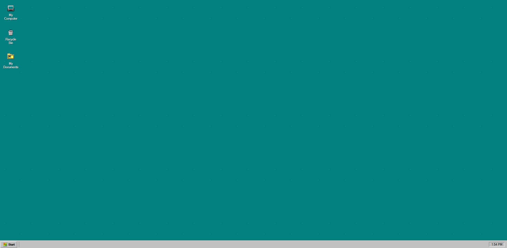

# Windows 95 Simulator

A nostalgic recreation of the Windows 95 desktop experience using HTML, CSS, and JavaScript.

## Features

- 🖥️ Authentic Windows 95 desktop interface
- 📁 Interactive desktop icons (My Computer, Recycle Bin, My Documents)
- 🖱️ Icon selection and double-click functionality
- 🎨 Pixel-perfect retro styling
- 📱 Responsive design

## Demo

Open `index.html` in your browser to experience the Windows 95 desktop.

## Technologies Used

- HTML5
- CSS3 (with custom Windows 95 styling)
- Vanilla JavaScript
- Classic Windows 95 fonts and color schemes

## Getting Started

1. Clone this repository
2. Open `index.html` in your web browser
3. Enjoy the nostalgia!

## Screenshots

## Roadmap

- [ ] Start Menu implementation
- [ ] Window management system
- [ ] File Explorer
- [ ] Classic Windows 95 applications
- [ ] System tray and taskbar
- [ ] Audio effects

## Contributing

Feel free to contribute to this project! Whether it's adding new features, fixing bugs, or improving the authentic Windows 95 experience.

## License

This project is open source and available under the MIT License.
